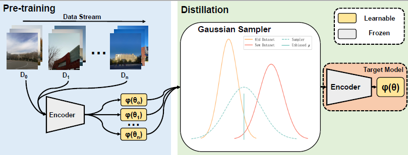

# DataMigration
Addressing Data Migration in Computer Vision-based Air Quality Monitoring: A Replay Learning-based Method

Air quality monitoring is of utmost importance for safeguarding both the environment and human health. 

We presents a novel approach to fit the air quality sky images through the replay learning, which leads to a top-1 total accuracy of 83.9\%, outperforming existing incremental learning benchmarks. This demonstrates the method's potential to significantly enhance air quality monitoring systems while maintaining computational efficiency. The code is coming soon.

With the proposed model enhancements, the authors envision a future where mobile phones can function as individual air quality monitoring stations with model-based software, thereby creating a dynamic and distributed AQI map for air quality protection.

